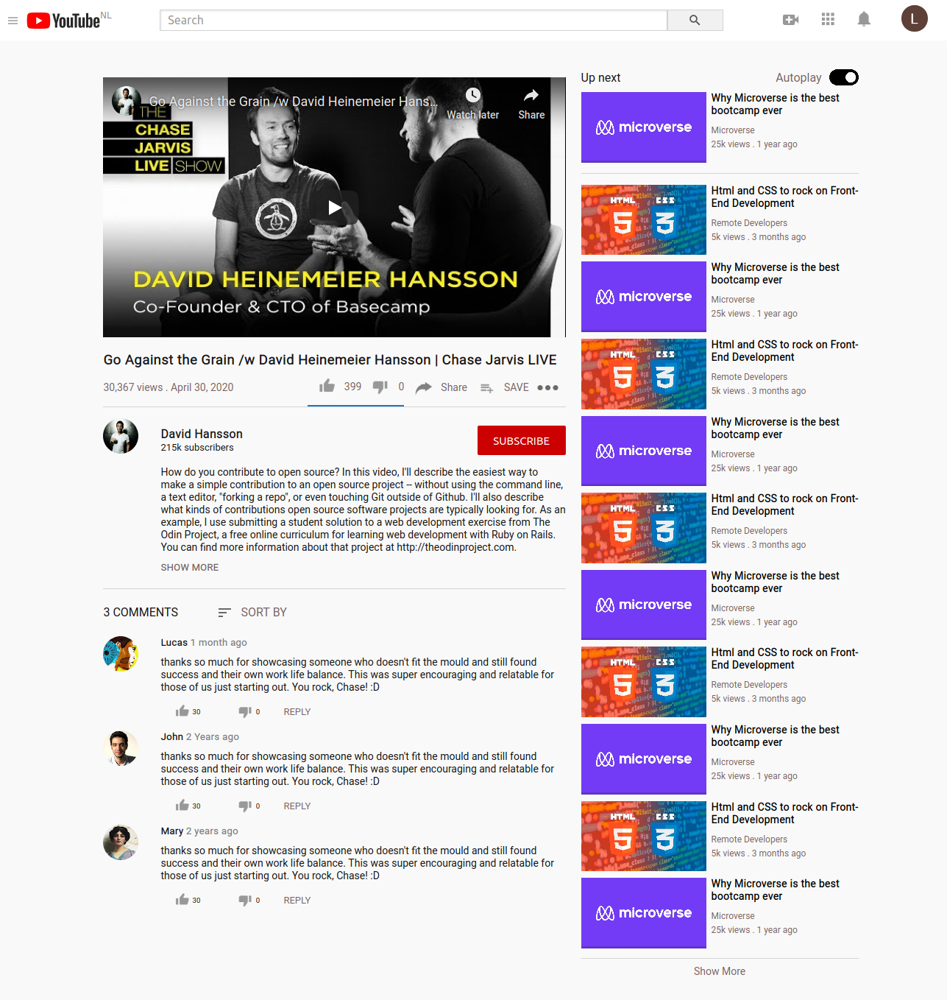

# Embedded Images and Video project - Roy and Lucas

> The page is a youtube clone page.

This project was made to demonstrate the authors' understanding of basic HTML and CSS concepts and their ability to work with media elements, such as embedded videos and images. 

## Built With
- HTML
- CSS

## Live Demo

[Live Demo Link](shorturl.at/zHK27)

## Authors

👤 **Lucas Delbel**

- Github: [@ldelbel](https://github.com/ldelbel)
- Twitter: [@delbel_lucas](https://twitter.com/delbel_lucas)
- Linkedin: [lucasdelbel](https://linkedin.com/in/lucasdelbel)

👤 **Roy Ntaate**

- Github: [@RNtaate](https://github.com/RNtaate)
- Twitter: [@RNtaate](https://twitter.com/RNtaate)
- Linkedin: [roy-ntaate](https://linkedin.com/in/roy-ntaate)

